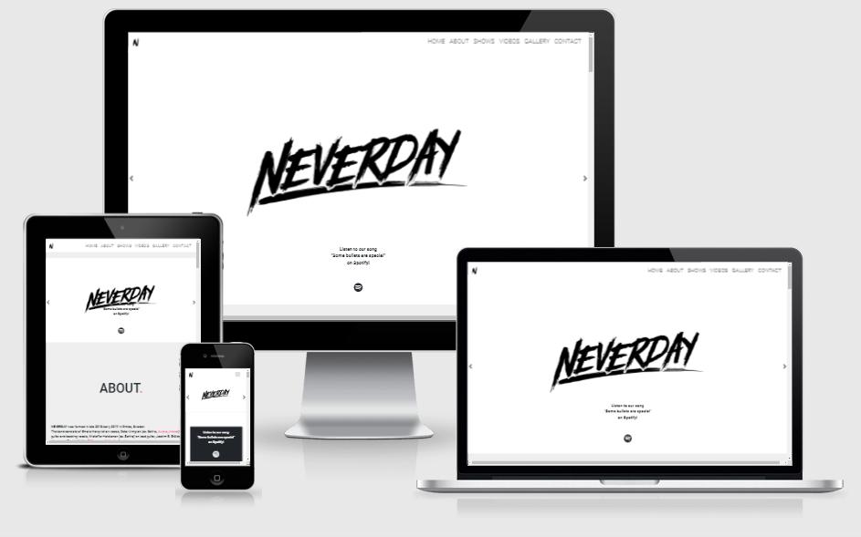
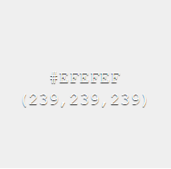
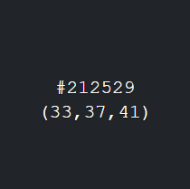
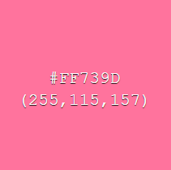
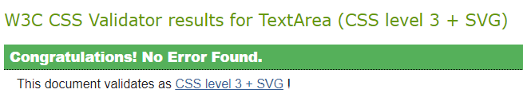
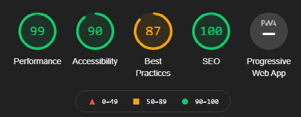
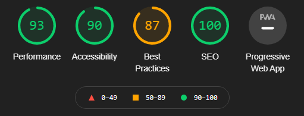
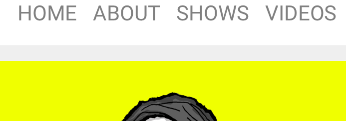
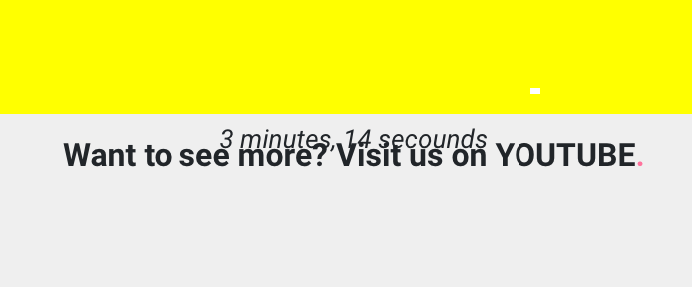
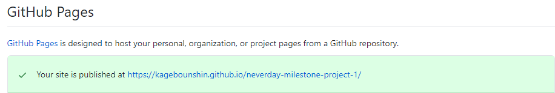

<h1 align="center"> The Neverday Website</h1>

[View the project here.](https://kagebounshin.github.io/neverday-milestone-project-1/)
<h2></h2>
                                
This is my first milestone project in User-Centric Frontend Development. An assignment from [CodeInstitute](https://codeinstitute.net/). 
The band wich this website is for, is a real band, and its called Neverday.  

Neverday plays punk/rock with influences from metal, hardcore and skatepunk. Combining energy and catchy melodies with lyrics about love, death and anxiety.

And guess what, I play with the band.

---
## Table Of Content
1.[**UX**](#ux) 
- [**User Stories**](#user-stories)
- [**Design**](#design)
- [**Wireframes**](#wireframes)

2.[**Features**](#features)
- [**Existing Features**](#existing-features)
- [**Features For The Future**](#features-for-the-future)

3.[**Technologies**](#technologies-used)


4.[**Testing**](#testing)

5.[**Deployment**](#deployment)

6.[**Credits**](#credits)
- [**Content**](#content)
- [**Media**](#media)
- [**Acknowledgements**](#acknowledgements)

---
## UX
---
### User stories

This site is for fans who likes to get to know the band and see what they are up to. To find information about upcoming shows, how to get tickets for the shows, and find out where they could listend to the music, see videos, and social media accounts.
 
Also for future employes that wishes to hire the band to play a show. They will get simple instructions on how to do so.

As a user:

* I want to have access to the website from any device.

* I want to be able to easily navigate through the website, so I can find what i'm looking for.

* I want to sign up for a newsletter to get the latest news, such as tour dates, merch, music etc.

* I want to read more about the band.

* I want to know when and where the band is playing a show.

* I want to know where I can purchases tickets to the shows.

* I want to know where I can listend to their music, watch their videos or visit their social media accounts etc.

* I want to be able to contact the band.

As an employer:

* I want to get easy access on how to contact the band for future requests. 


 
### Design

---

- Color Scheme
    - The website has a "light grey" background (#EFEFEF), and I used a "dark grey "(#212529) color to make a nice transaction between the diffrent sections. 
    - The news section wich is shown only on smaller devices and the footer has a white backgrounds(#fff).
    - The navbar has a white background (#fff) aswell.  
    - The dots in all the section headings, some links and buttons and the commas on the personal cards are pink (#FF739D). 
    - When you hover over the headings and the buttons or links, the text is turned to pink (#FF739D) aswell. 
    - The font colors differs between the sections, if the section has the "light grey" (#EFEFEF) background, its has the "dark grey" (#212529) color set on the text and the other way around. 
    



- Typography
    - I've used the Roboto font from [GoogleFonts](https://fonts.google.com/specimen/Roboto?preview.text_type=custom#glyphs), I think its has a clean look, easy to read, simply looks nice. The fall back font is sans-serif if the main font shouldn't work properly. 
    - For the personal cards I used five different type of fonts from the "Handwriting" category at [GoogleFonts](https://fonts.google.com/?category=Handwriting). They are [Pangolin](https://fonts.google.com/specimen/Pangolin?preview.text_type=custom), [Permanent Marker](https://fonts.google.com/specimen/Permanent+Marker?preview.text_type=custom), [Homemade Apple](https://fonts.google.com/specimen/Homemade+Apple?preview.text_type=custom), [Just Me Again Down Here](https://fonts.google.com/specimen/Just+Me+Again+Down+Here?preview.text_type=custom), [Butterfly Kids](https://fonts.google.com/specimen/Butterfly+Kids?preview.text_type=custom). They where used to make it as if the answers on the cards was written by hand. 
    

- Images 
    - I have two images in a carousel right at the homepage, the first one is the bands logo, it has an animation set to it, just to make the first apperans more intresting. And a text with some additional information about our music. The second images is the grimreaper and our logo, and a text with information on how to sign up for the newsletter (On smaller devices both paragraphs are pushed down below the pictures).
    - At the "About" section you'll find a picture of the band, and five personal pictures one of each band member. The personal pictures has an hover effect and a flip animation to it. When you hover the cards with the mouse, the images fades and the hovered band members name appears. And when you click the picture, the card flips and reveals a backside with a little information about the band member.
    - On smaller devices the hover effect on the personal cards are gone. The images is faded from the start and the name is already displayed.
    - And a carousel down at the Gallery section, showing diffrent images made by Peter Almgren. 

### Wireframes

--- 

* Home, Gallery and shows page.
    - My first idea was to have three diffrent pages for the website, but after my first call with my mentor, we decided to go with a singel scrolling page to get a better experiense. 


---


## Features

### Existing Features


#### Navbar
- At the top of the page is the navbar, and it is fixed to the top, so it will follow you up and down when you are navigating your way through the website. You can easily navigate your way through the diffrent sections, to get back to the top you can press either the logo to the left or "Home". When you are visiting the site on smaller devices the nav links will collapse into a burger menu.


#### Home
- I have used the carousel component from bootstrap. When you open the page to logo appears with some aninmation, followed by a text and an spotify icon, the icon points you in the direction to our music. The second picture has a text and an "envelope" icon, press the icon and you'll get to a modal, there you can Subscribe for the newsletter. If shown on smaller devices, the information text will be push down below the images.   

#### Newsletter Form

- Click the "envelope" icon, and you will be directed to a modal. In that modal you can enter your emailadress and then submit it by clicking the 'Subscribe' button.

#### About

- This is where you can read about Neverday and its members. A short but informative text, and an image of the band. The members is discribed in a text below that image. Then there is five personal cards with an images of each band member. It has a "flip" function, so if you click them the card flips over and reveals some personal information. 

##### Shows

- Here you can find out when and where Neverday is performing live. A tickets button that directs you to where you can purchase a ticket. A link to the "Contact" section, if you would like to book the band for a show.

#### Videos

- In this section you can watch a music video from Neverday embedded from Youtube. Below the video is a link to our Youtube page. 

#### Gallery

- I have used the carousel component from bootstrap. So you can use the arrows on the sides to toggle between the next and the previous pictures. And a link below to our Instagram.

#### Contact

- This is where you can contact the Neverday, about future show request or just anything that comes to mind. 
 
#### Footer

- In the footer there is icons to our social media accounts, and icons to streaming services wich provides you with the music you want to here. And a newsletter link wich takes you to the newsletter modal, there you can fill in your email.


#### To Summarize

Users can:

* Easily navigate up and down the website with the fixed to the top navbar .

* Find out were they can listend to Neverday's music.

* Sign up for a newsletter.

* Find information about the band in the about section. 

* See Neverday's tour dates at the shows section.

* Purchase tickets at the shows section.

* Watch the bands music videos and some pictures.

* Contact the band at the contact section.

Employers can:

* Contact the band about future requests at the contact section. 

### Features For The Future 

* I would like for my forms to work, so they fulfill their purpose.

* I would like to have more information about every member of Neverday.

* I would like to implement a music section. There you will be able to listend to our music directley on the site, and read the lyrics for our realeased songs. 

* A merch section were you can buy clothes and our upcoming EP.

---


## Technologies Used

### Languages

* [HTML5](https://en.wikipedia.org/wiki/HTML5)

* [CSS3](https://en.wikipedia.org/wiki/CSS)


### Framework, Libraries and Tools Used

* [jQuery](https://jquery.com/) - Used for the flipcard.

* [Bootstrap](https://getbootstrap.com/) - Frontend framework, used for responsivness and styling.

* [GoogleFonts](https://fonts.google.com/) - to import fonts.

* [FontAwesome](https://fontawesome.com/) - to import icons. 

* [Git](https://git-scm.com/) - Git was used for version control.

* [GitHub](https://github.com/) - GitHub was used to store the project.

* [GitHubPages](https://pages.github.com/) - Deployment

* [Balsamiq](https://balsamiq.com/) - Balsamiq was used to create the wireframes during the design process.

* [Am I Responsive](http://ami.responsivedesign.is/#) - Tested responsivness & the images at the top of the readMe.

* [Color Hex](https://www.color-hex.com/) - The color images wich are displayed at the [**Design**](#design) section of this readMe.

* [PicResize](https://picresize.com/) - was used to resize the personal images at the "About" section.
---

## Testing


The W3C Markup Validator and W3C CSS Validator Services were used to validate the website.

* [W3C Markup Validator](https://validator.w3.org/) - [Result](https://validator.w3.org/nu/?doc=https%3A%2F%2Fkagebounshin.github.io%2Fneverday-milestone-project-1%2F)
* [W3C CSS Validator](https://jigsaw.w3.org/css-validator/#validate_by_input) - No errors found. 




### Testing User Stories from (UX) section.

* When im visit the site for the first time, I want to get a clear understanding whats the site is about. 
    - When I enter the site, I see a navbar and its links, and it takes me to the sections I desire to visit.
    - The bands logo scales and fades in, with some text with a link to spotify. 
    - It's easy to navigate up & down the site, using the fixed to the top navbar.

* I want to listend to music made by the band. 
    - When I open the website, I can do so directley by clicking the spotify icon at the hero image. 
    - Or if I scroll down to the bottom of the page I can see three diffrent icons wich leads me to the bands music.  

* I want to purchase a ticket for a show. 
    - I open the website and locating the "Shows" section, either by scrolling down or pressing the "Shows" link at the navbar.
    - I can see the dates and the locations, and a "Tickets" button wich leads me to the site were I can purchase my tickets. 

* I would like to know more about the band. 
    - I open up the site, I can locate the "About" section, either by the "About" link in the navbar or by scrolling down. 
    - There I see a short but informative text discriding the band and its members, a picture with all the band members and a text below the picture decribing the images. 
    - And images of each band members wich you can flip over and reveal more information about the members.

* I have heard about the band, and I would like to book them for a show.
    - I open the website, I can see there is a "Contact" section at the navbar. 
    - I click the link and it takes me down to a form, where I enter my name, email and a message. Then I press the "Send" button.
    - If I scroll down to the "shows" section, there is a link wich also takes me down to the "Contact" section.

* I would like to get the latest news from the band.
    - I enter the site and on the second picture in the header I find a text and an "Envelope" icon, I press the icon and a modal comes up, I can now enter my Email and the press the "Subscribe" button.

    - I enter the site, scrolls down to the bottom of the page, at the footer I find a "Newsletter" button, I press the button, and the same modal pops up. I can now enter my Email and then press the "Subscribe" button.

    - On smaller devices, I find the newsletter button below the carousel in the header. I press the "Envelope" icon, and the newletter modal pops up. I can now enter my Email and the press the "Subscribe" button.

### Lighthouse testing.
* Desktop



* Mobile



### Further testing

* The website is tested on Google Chrome & Microsoft Edge, Safari.
* The website was viewed on diffrent devices such as Desktop, Laptop, Iphone X, Iphone 8 & Iphone 7, Sony Experia Z1, Ipad.
* The links are tested alot, to ensure they work correctly.
* Family members has tested the site, looking for bugs or other issues. 


### Bugs

* Discoverd two bugs on my Ipad from 2014 using the safari browser, the Ipad dosn't have the latest updates installed, so it's not up to date. I didn't fix these two bugs, becouse the Ipad is at the end of it's lifespan. And I haven't come across these bugs on other devices i've been testing on.
    * The first one is a little space between the navbar and the "Home" carousel. The carousel is pushed down from the navbar. There is no such space on any of the other devices I've been testing on. 
    

    * The second one is below the embedded video at the "Videos" section, as you can see the text is pushed up almost covering the first paragraph. Only seen this bug on my Ipad from 2014.
    


---
## Deployment
 
### GitHub Pages

My project was deployed to GitHub Pages, following these steps..

1. Log in to [GitHub](https://github.com/) and locate the [GitHub Repository](https://github.com/Kagebounshin/neverday-milestone-project-1).
2. At the top of the Repository, locate the "Settings" Button on the menu.
3. Scroll down the Settings page until you locate the "GitHub Pages" Section.
4. Under "Source", click the dropdown called "None" and select "Master Branch".
5. The page will refresh.
6. Scroll back down through the page to locate the now published site in the "GitHub Pages" section.




### Forking the GitHub Repository

By forking the GitHub Repository you can make a copy of the original repository to your GitHub account to just view or make changes without affecting the original. Use these steps or press this [link](https://docs.github.com/en/github/getting-started-with-github/fork-a-repo).

1. Log in to [GitHub](https://github.com/) and locate the [GitHub Repository](https://github.com/Kagebounshin/neverday-milestone-project-1).
2. In the top-right corner of the page, click Fork.
3. Now you will have a copy of the original repository in your GitHub account.

### Making a Local Clone

Follow these steps or press this [link](https://docs.github.com/en/github/creating-cloning-and-archiving-repositories/cloning-a-repository#cloning-a-repository-to-github-desktop).

1. Log in to GitHub and locate the [GitHub Repository](https://github.com/Kagebounshin/neverday-milestone-project-1)
2. Above the list of files, click "Code".
3. To clone the repository using HTTPS, under "Clone with HTTPS", copy the link.
4. Open Git Bash
5. Change the current working directory to the location where you want the cloned directory to be made.
6. Type `git clone`, and then paste the URL you copied in Step 3.

```
$ git clone https://github.com/Kagebounshin/neverday-milestone-project-1
```

7. Press Enter to create your local clone.

```
$ git clone https://github.com/Kagebounshin/neverday-milestone-project-1
> Cloning into `CI-Clone`...
> remote: Counting objects: 10, done.
> remote: Compressing objects: 100% (8/8), done.
> remove: Total 10 (delta 1), reused 10 (delta 1)
> Unpacking objects: 100% (10/10), done.
```

---
## Credits

### Content


* [Smooth scroll](https://www.codegrepper.com/code-examples/html/css+smooth+scroll+between+sections) (written by: deadlymuffin) between the sections.

* All the icons was obtained from [fontAwesome](https://fontawesome.com/icons?d=gallery)

* Main font and the diffrent fonts in the personal cards was all obtained from [GoogleFonts](https://fonts.google.com/) 

* [Copyright symbol](https://www.toptal.com/designers/htmlarrows/symbols/copyright-sign/) used at the bottom of the page.

* Was used to changes the color of the [Next / Prev](https://forum.freecodecamp.org/t/bootstrap-carousel-controls-color/331196) arrows in both carousels.

### Media

* [Animation](https://codepen.io/bycreator/pen/RNQmZK) - for personal cards.

* [Animation](https://gist.github.com/jakejarvis/ec46fe0efdd7c71de56fcb594b1dee51) - (written by: Jake Jarvis) for the contact icon (with some modifications).

* [Animation](https://blog.hubspot.com/website/css-fade-in) (written by: [Maddy Osman](https://blog.hubspot.com/website/author/maddy-osman)) the fadeIn animation used in the heading section.

* [Animation](https://webplatform.github.io/docs/tutorials/css_animations/) (written by: Mike Sierra) for the heading icon (with some modifications).

* The hover effect on the personal cards was obtained from [w3schools](https://www.w3schools.com/howto/tryit.asp?filename=tryhow_css_image_overlay_opacity)  (with some modifications).

* All the music was originaly recorded by Neverday.

* Some images was taken from the bands [Facebook](https://www.facebook.com/Neverday-101187714601074) or the band members Facebook accounts or Instagram accounts. 

### Acknowledgements 

* Family and friends for testing & support.

* Peter Almgren - Illustrations.

* All the band members of Neverday. 

* Mentor Medale Oluwafemi, for feedback and layout inspiration.
 ---


