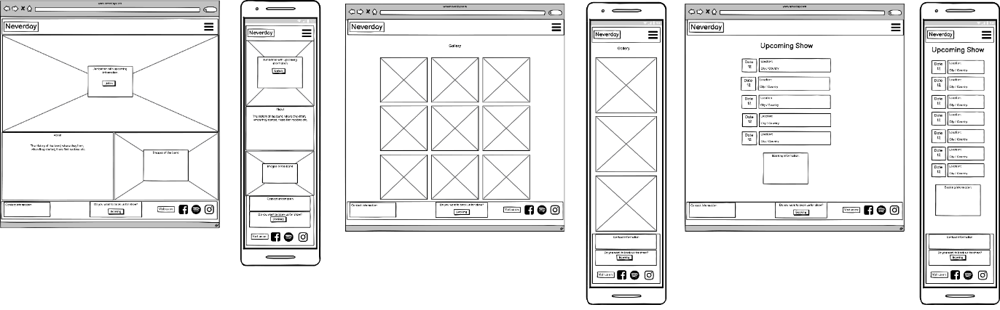

<h1 align="center"> The Neverday Website</h1>

[View the project here.](https://kagebounshin.github.io/neverday-milestone-project-1/)
<h2></h2>
                                
This is my first milestone project in User-Centric Frontend Development. An assignment from [CodeInstitute](https://codeinstitute.net/). 
The band wich this website is for, is a real band, and its called Neverday.  

Neverday plays punk/rock with influences from metal, hardcore and skatepunk. Combining energy and catchy melodies with lyrics about love, death and anxiety.

And guess what, I play with the band.

---
## Table Of Content
1.[**UX**](#ux) 
- [**User Stories**](#user-stories)
- [**Design**](#design)
- [**Wireframes**](#wireframes)

2.[**Features**](#features)
- [**Existing Features**](#existing-features)
- [**Features For The Future**](#features-for-the-future)

3.[**Technologies**](#technologies-used)
- [**Languages**](#languages)
- [**Framework and Libraries**](#framework-and-libraries)
- [**Tools used**](#tools-used)

4.[**Testing**](#testing)

5.[**Deployment**](#deployment)

6.[**Credits**](#credits)
- [**Content**](#content)
- [**Media**](#media)
- [**Acknowledgements**](#acknowledgements)

---
## UX
---
### User stories

This site is for fans who likes to get to know the band and see what they are up to. To find information about upcoming shows, how to get tickets for the shows, and find out where they could listend to the music, see videos, and social media accounts.
 
Also for future employes that wishes to hire the band to play a show. They will get simple instructions on how to do so.

As a user:

* I want to have access to the website from any device.

* I want to be able to easily navigate through the website, so I can find what i'm looking for.

* I want to sign up for a newsletter to get the latest news, such as tour dates, merch, music etc.

* I want to read more about the band.

* I want to know when and where the band is playing a show.

* I want to know where I can purchases tickets to the shows.

* I want to know where I can listend to their music, watch their videos or visit their social media accounts etc.

* I want to be able to contact the band.

As an employer:

* I want to get easy access on how to contact the band for future requests. 

 
### Design

---

- Color Scheme
    - The website has a white background, and two diffrent types of light grey to make an nice transaction between the sections. 

- Typography
    - I've used the Roboto font from [GoogleFonts](https://fonts.google.com/specimen/Roboto?preview.text_type=custom#glyphs), I think its clean and looks really nice. The fall back font is sans-serif. 

- Images 
    - I have two images in a carousel right at the homepage, the first one is the bands logo, and a text with some additional information about our music. The second images is with the grimreaper and our logo, and a text with information on how to sign up for the newsletter. 

### Wireframes

--- 

* Home, Gallery and shows page.

 

---

## Features

### Existing Features

#### Navbar
- At the top of the page is the navbar, and it is fixed to the top, so it will follow you up and down when you are navigating your way through the website. You can easily navigate your way through the diffrent sections, to get back to the to you can press either the logo to the left or "Home". When you are visiting the site on smaller devices the nav links will collapse into a burger menu.

#### Home
- When you open the page to logo appears with some aninmation, followed by a text and an spotify icon, the icon points you in the direction to our music. The second picture has a text and a sign up button, press the button and you'll get to a modal, there you can sign up for the newsletter. If shown on smaller devices, the information text will be push down below the images.   

#### Newsletter form

- Click the sign up button, and you will be directed to a modal. In that modal you can enter your emailadress and then submit it when you click on the 'Subscribe' button.

#### About

- This is where you can read about Neverday, its a short but informative text, and an image of the members. The members is discribed in a text below the image.

##### Shows

- Here you can find out when and where Neverday is performing live. A tickets button that directs you to where you can purchase a ticket.

#### Videos

- In this section you can watch Neverdays music videos, The videos are embeded from youtube. 

#### Gallery

- I have used the carousel component from bootstrap. So you can use the arrows on the sides to toggle between the next and the previous pictures.

#### Contact

- This is where you can contact the Neverday, about future show request or just anything that comes to mind. 
 
#### Footer

- In the footer there is icons to our social media accounts, and icons to streaming services wich provides you with the music you want to here. 

#### To Summarize

Users can:

* Easily navigate up and down the website with the fixed to the top navbar.

* Find out were they can listend to Neverday's music.

* Sign up for a newsletter.

* Find information about the band in the about section. 

* See Neverday's tour dates at the shows section.

* Purchase tickets at the shows section.

* Watch the bands music videos and some pictures.

* Contact the band at the contact section.

Employers can:

* Contact the band about future requests at the contact section. 

### Features For The Future 

* I would like for my forms to work, so they fulfill their purpose.

* I would like to have more information about every member of Neverday.

* I would like to implement a music section. There you will be able to listend to our music directley on the site, and read the lyrics for our realeased songs. 

* A merch section were you can buy clothes and our upcoming album.

---

## Technologies Used

### Languages

* [HTML5](https://en.wikipedia.org/wiki/HTML5)

* [CSS3](https://en.wikipedia.org/wiki/CSS)

### Framework, Libraries and Tools Used

* [Bootstrap](https://getbootstrap.com/) - Frontend framework, used for responsivness and styling.

* [GoogleFonts](https://fonts.google.com/) - to import fonts.

* [FontAwesome](https://fontawesome.com/) - to import icons. 

* [Git](https://git-scm.com/) - Git was used for version control.

* [GitHub](https://github.com/) - GitHub was used to store the project.

* [Balsamiq](https://balsamiq.com/) - Balsamiq was used to create the wireframes during the design process.

---

## Testing

The W3C Markup Validator and W3C CSS Validator Services were used to validate the website.

* [W3C Markup Validator](https://jigsaw.w3.org/css-validator/#validate_by_input) - [Result](https://validator.w3.org/nu/?doc=https%3A%2F%2Fkagebounshin.github.io%2Fneverday-milestone-project-1%2F)
* [W3C CSS Validator](https://jigsaw.w3.org/css-validator/#validate_by_input) - No current errors. 

### Testing User Stories from (UX) section.

* When im visit the site for the first time, a get a clear understanding on how to site is built. It's easy to navigate up & down the site, using the existing navbar. With the navbar fixed to the top I can navigate between the sections. The navbrand takes me right back to the top.

* I want to listend to music made by the band. When I open the website, I can do so directley by pressing the spotify icon right at the begining. Or if I scroll down to the bottom of the page I can see three diffrent icons wich would lead me to their music.  

* I want to purchase a ticket for a show. I open the website and locating the shows section, either by srcolling down or pressing the shows nav-link at the navbar. I can see the dates and the locations, and a "Tickets" button wich leads me to the site to purchase my ticket. 

* I would like to know more about the band, I can open up the site, and then locate the about section, either by scrolling down or using the navlink in the navbar. There I see a short but informative text discriding the band and its members, a picture with all the band members and a text below the picture with the names of the bandmembers.

* I have heard about the band, and I would like to book them for a show, so I open the website, I can see there is a contact section at the navbar. I click the navlink and it takes me down to a form, where I enter my name, email and a message. The I press the "Send" button. 

* I would like to get the latest news from the band.
    - I enter the site and on the second picture in the header I find a "SIGN UP" button, I press the button and a modal comes up,  I can now enter my Email and the press the "Subscribe" button. (not displayed on small devices).

    - I enter the site, scrolls down to the bottom of the page, at the footer I find a "Newsletter" button, I press the button, and the same modal pops up.  I can now enter my Email and the press the "Subscribe" button.

    - On smaller devices, I find the newsletter button below the carousel in the header. I press the button, and the newletter modal pops up. I can now enter my Email and the press the "Subscribe" button.

### More testing

* The website is tested on Google Chrome & Microsoft Edge.
* The website was viewed on diffrent devices such as Desktop, Laptop, 
* Tested links was done, to ensure they work correctly.

---
## Deployment
 
### GitHub Pages

My project was deployed to GitHub Pages, following these steps..

1. Log in to [GitHub](https://github.com/) and locate the [GitHub Repository](https://github.com/Kagebounshin/neverday-milestone-project-1).
2. At the top of the Repository, locate the "Settings" Button on the menu.
3. Scroll down the Settings page until you locate the "GitHub Pages" Section.
4. Under "Source", click the dropdown called "None" and select "Master Branch".
5. The page will refresh.
6. Scroll back down through the page to locate the now published site in the "GitHub Pages" section.

### Forking the GitHub Repository

By forking the GitHub Repository you can make a copy of the original repository to your GitHub account to just view or make changes without affecting the original. Use these steps or press this [link](https://docs.github.com/en/github/getting-started-with-github/fork-a-repo).

1. Log in to [GitHub](https://github.com/) and locate the [GitHub Repository](https://github.com/Kagebounshin/neverday-milestone-project-1).
2. In the top-right corner of the page, click Fork.
3. Now you will have a copy of the original repository in your GitHub account.

### Making a Local Clone

Follow these steps or press this [link](https://docs.github.com/en/github/creating-cloning-and-archiving-repositories/cloning-a-repository#cloning-a-repository-to-github-desktop).

1. Log in to GitHub and locate the [GitHub Repository](https://github.com/Kagebounshin/neverday-milestone-project-1)
2. Above the list of files, click "Code".
3. To clone the repository using HTTPS, under "Clone with HTTPS", copy the link.
4. Open Git Bash
5. Change the current working directory to the location where you want the cloned directory to be made.
6. Type `git clone`, and then paste the URL you copied in Step 3.
   
    `$ git clone https://github.com/Kagebounshin/neverday-milestone-project-1`

7. Press Enter to create your local clone.

    > Cloning into `Spoon-Knife`...
    > remote: Counting objects: 10, done.
    > remote: Compressing objects: 100% (8/8), done.
    > remove: Total 10 (delta 1), reused 10 (delta 1)
    > Unpacking objects: 100% (10/10), done.

---
## Credits

### Content

* [Smooth scroll](https://www.codegrepper.com/code-examples/html/css+smooth+scroll+between+sections) (written by: deadlymuffin) between the sections.

* Social media icons was taken from [fontAwesome](https://fontawesome.com/icons?d=gallery)

* Main font was taken from [GoogleFonts](https://fonts.google.com/)

* [Copyright symbol](https://www.toptal.com/designers/htmlarrows/symbols/copyright-sign/) used at the bottom of the page.

### Media

* [Animation](https://blog.hubspot.com/website/css-fade-in) (written by: [Maddy Osman](https://blog.hubspot.com/website/author/maddy-osman)) the fadeIn animation used in the heading section.

* [Animation](https://webplatform.github.io/docs/tutorials/css_animations/) (written by: Mike Sierra) for the heading icon (with some modifications).

* All the music was originaly recorded by Neverday.

* Some (not all) images was taken from the bands [Facebook](https://www.facebook.com/Neverday-101187714601074). 

### Acknowledgements 

* Peter Almgren - Illustrations.

